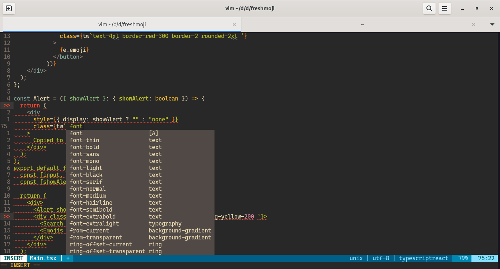

# coc-twind

Add completion for twind css, this useful for react projects for example

## Install

`Plug 'sigmaSd/coc-twind', {'do': 'yarn install --frozen-lockfile'}`

## License

MIT

---

> This extension is built with [create-coc-extension](https://github.com/fannheyward/create-coc-extension)
